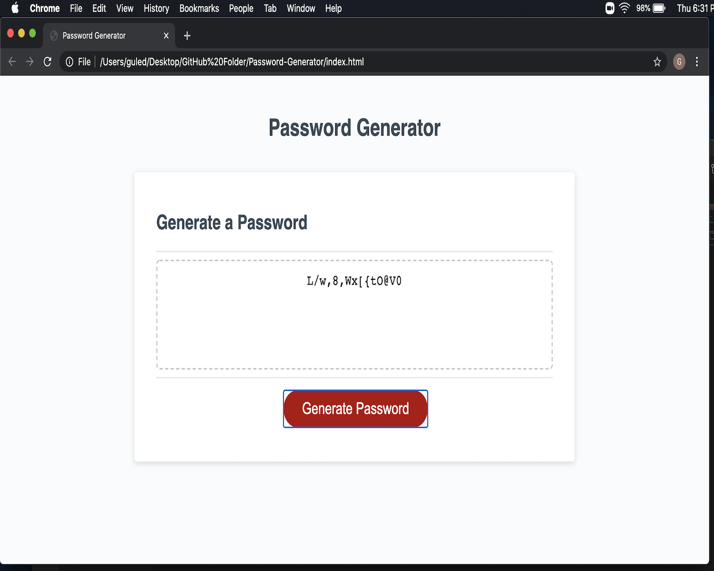

# Password-Generator
 
<h1>DESCRIPTION:</h1>

Hello and welcome. This application is a password generating app. It will generate a random password based on selected criteria. The application will run in the browser and feature dynamically updated HTML and CSS, powered by a JavaScript code.
 
<h1>THE USER'S PURPOSE:</h1>

<h2>The user of this application will be prompted to choose from the following password criteria:</h2>

1) The length of the desired password must be at least 8 characters and no more than 128 characters long.

<h2>The character types the user can choose will include the following (examples):</h2>

1) Lowercase characters (a, b, c, d)

2) Uppercase characters (A, B, C, D)

3) Numeric characters (1, 2, 3, 4)

4) Special characters (!, @, $, *)
 
<h1>THE COMPUTER'S PURPOSE</h1>

Once the user completes his part of the task, the computer will now generate a new password. The computer will first take the length of the password chosen by the user. Afterwards, the computer will record the desired characters the user selected and push those characters into a single location to match the length of the password. If the user selected the length of his password to be 21 characters long for instance and then selected his password to contain lowercase characters, numeric characters and special characters (notice the user did not select uppercase characters), then the computer will generate a password that is 21 characters long consisting of only lowercase characters, numeric characters and special characters. This three types of characters that were chosen will then be randomly placed together in random order and presented to the user as his/her new password. 

The application will record and safe the user's selected characters he/she desired. When the user answers the series of  prompts, prompting him/her to select or not selecting their desired input, the computer will generate a password length the user chose and that password will be containing the user's desired characters.
 
<h1>END RESULT:</h1>

Once the password has been randomly generated to contain the desired characters that were selected by the user, the password will appear in the text-box where the user can copy and paste to wherever he/she desires. Below is a screen-shot of the password generating application, displaying a password consisting of 15 characters that were randomly put together by the computer. The characters consist of lowercase letters, uppercase letters, numbers and special characters.
 
 
 
